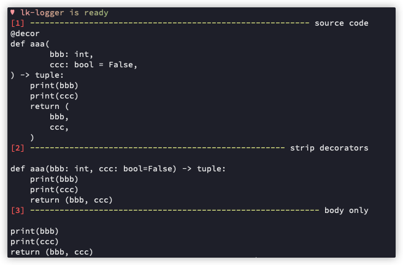

# Get Function Source

## Requirements

- astunparse

optional (for test):

- astpretty
- lk-logger

## Code

`get_func_source.py`:

```py
import ast
import inspect
from astunparse import unparse

def get_source(
        func, 
        strip_decorators=True, 
        strip_signature=False,  # aka. body_only
        strip_return=False,
) -> str:
    """
    https://stackoverflow.com/a/57040815
    notice: if either `strip_decorators` or `strip_signature` is True, the 
        output code may slightly changed by removing *unnecessary* line breaks.
    """
    code: str = inspect.getsource(func)
    if strip_decorators or strip_signature:
        module = ast.parse(code)
        target_func = module.body[0]
        if strip_decorators:
            target_func.decorator_list.clear()
        if strip_return:
            # FIXME: support only stripping final-line return
            if target_func.body and isinstance(
                target_func.body[-1], 
                ast.Return
            ):
                target_func.body.pop()
        if strip_signature:
            body = target_func.body
            out = unparse(body)
        else:
            out = unparse(target_func)
    else:
        out = code
    return out.strip()
```

## Test

```py
import lk_logger
from get_func_source import get_source

lk_logger.setup(
    show_source=False,
    show_funcname=False,
)

def decor(func):
    return func

@decor
def aaa(
    bbb: int,
    ccc: bool = False,
) -> tuple:
    print(bbb)
    print(ccc)
    return (
        bbb,
        ccc,
    )

if __name__ == '__main__':
    print(':di', 'source code')
    print(get_source(aaa, strip_decorators=False))
    print(':di', 'strip decorators')
    print(get_source(aaa, strip_decorators=True))
    print(':di', 'body only')
    print(get_source(aaa, strip_decorators=True, body_only=True))
```

the output:


