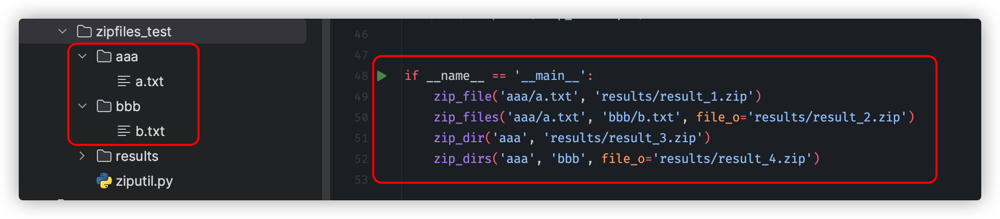

# Python 标准库 zipfile 压缩文件/文件夹

## 压缩单个文件

```python
from zipfile import ZipFile
with ZipFile('output.zip', 'w') as z:
    z.write('input.txt')
```

## 压缩多个文件

要求:

- 将多个文件压缩后, 处于同一目录下 (也就是 zip 文件中, 不包含子目录结构)
- 这些源文件可能来自不同的目录

```python
from os.path import basename
from zipfile import ZipFile

def zip_files(*files):
    with ZipFile('output.zip', 'w') as z:
        for f in files:
            z.write(f, arcname=basename(f))
```

## 压缩单个目录

讲解:

压缩单个目录时, ZipFile 需要 write 目录, 以及目录下每一个文件 (包括子文件夹的文件) 的路径.

这些路径在 zip 文件中有一个公共的前缀, 也就是根目录的目录名, 如下所示:

```
output.zip
|= root  # 这是公共的前缀
   |- aaa.txt
   |- bbb.txt
   |= ccc
      |- ddd.txt
```

```python
import os
import os.path
from zipfile import ZipFile

def zip_dir(dir_):
    with ZipFile('output.zip', 'w') as z:
        z.write(dir_, arcname=(dn := os.path.basename(dir_)))
        for root, dirs, files in os.walk(dir_):
            for fn in files:
                z.write(
                    fp := os.path.join(root, fn),
                    arcname=dn + '/' + os.path.relpath(fp, dir_)
                    #       ^^^^^^^^^^ 特别注意这里.
                )
```

## 压缩多个目录

要求:

- 取它们的公共路径部分作为前缀. 例如:

    输入:

    ```
    c:
    |= aaa
       |= mmm
          |- foo.txt
       |= nnn
          |- bar.txt
    ```

    输出:

    ```
    result.zip
    |= mmm
       |- foo.txt
    |= nnn
       |- bar.txt
    ```

```python
import os
import os.path
from zipfile import ZipFile

def zip_dirs(*dirs):
    prefix = os.path.commonprefix(dirs)
    with ZipFile('output.zip', 'w') as z:
        for d in dirs:
            z.write(d, arcname=os.path.relpath(d, prefix))
            for root, dirs, files in os.walk(d):
                for fn in files:
                    z.write(
                        fp := os.path.join(root, fn),
                        arcname=os.path.relpath(fp, prefix)
                    )
```

## 脚本

我将上述片段合并到一个脚本里面了, 名称为 "ziputil.py", 代码如下:

```python
import os
import os.path
from zipfile import ZipFile


def zip_file(file_i: str, file_o: str) -> None:
    with ZipFile(file_o, 'w') as z:
        z.write(file_i, arcname=(n := os.path.basename(file_i)))
        print('zip_file:', n)


def zip_files(*files_i: str, file_o: str) -> None:
    with ZipFile(file_o, 'w') as z:
        for f in files_i:
            z.write(f, arcname=(n := os.path.basename(f)))
            print('zip_files:', n)


def zip_dir(dir_i: str, file_o: str) -> None:
    dir_i_parent = os.path.dirname(dir_i)
    with ZipFile(file_o, 'w') as z:
        z.write(dir_i, arcname=(n := os.path.basename(dir_i)))
        print('zip_dir:', n)
        for root, dirs, files in os.walk(dir_i):
            for fn in files:
                z.write(
                    fp := os.path.join(root, fn),
                    arcname=(n := os.path.relpath(fp, dir_i_parent)),
                )
        print('zip_dir:', n)


def zip_dirs(*dirs_i: str, file_o: str) -> None:
    prefix = os.path.commonprefix(dirs_i)
    with ZipFile(file_o, 'w') as z:
        for d in dirs_i:
            z.write(d, arcname=(n := os.path.relpath(d, prefix)))
            print('zip_dirs:', n)
            for root, dirs, files in os.walk(d):
                for fn in files:
                    z.write(
                        fp := os.path.join(root, fn),
                        arcname=(n := os.path.relpath(fp, prefix)),
                    )
            print('zip_dirs:', n)

```

## 实战 (截图)




