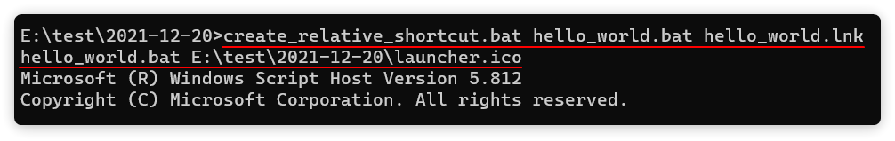
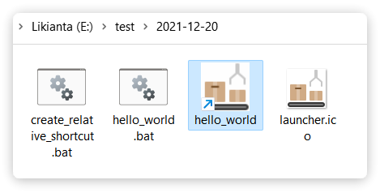
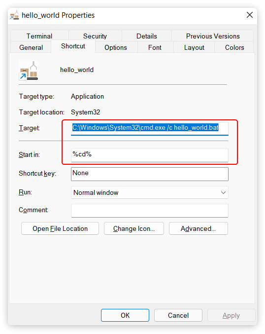

# Windows 通过 BAT 脚本创建相对路径的快捷方式

网上没有找到相关的结果. 这是我综合多个答案的线索找到的一个简单有效的方案.

本文解决以下问题:

- bat 怎么创建快捷方式
- 快捷方式需要带上图标
- 快捷方式怎么用相对路径 (这样可以把快捷方式的启动器放入自己的应用, 打包发给别人也能使用)

注: 该教程的目的是帮助开发者快速封装自己的 bat 启动器为 lnk 格式, 并添加自己的启动器图标, 提升应用美观性.

## 快速开始

直接拷贝下个章节提供的源代码, 保存为 "create_relative_shortcut.bat" 文件. 通过 cmd 调用:

```bat
# 使用示例
create_relative_shortcut.bat E:\test\my_script.bat E:\test\my_script.lnk my_script.bat E:\test\launcher.ico

# 命令格式: create_relative_shortcut.bat <file_i> <file_o> <relative_path> <icon>
    # relative_path:
        # 相对路径, 推荐使用 file_i 相对于 file_o 的路径.
        # 在本示例中, 生成的相对路径指向 "./my_script.bat".
        # 该参数可自定义, 也可以传一个事先不存在的路径. 例如, 填 "..\my_script.bat", 
        # 则生成的快捷方式在启动时会往它的上级目录找 my_script.bat.
    # icon:
        # 这是一个可选参数. 如果不传这个参数, 则使用快捷方式的默认图标.
```

大概不到 1 秒即可生成.

## 源代码及详细注释

> 注意: 下面放了有注释版和无注释版的源代码, 经个人测试有注释版的因不明原因运行到一半就结束了; 无注释版的可以正常使用. 该问题正在修复中, 在修复完成前, 请复制无注释版的源码保存.

create_relative_shortcut.bat (有注释版)

```bat
@REM 关闭打印
@echo off

@REM 接收传入的参数
set file_i=%1
set file_o=%2
set relative_path=%3
set icon=%4

@REM 由于 icon 是可选参数, 如果用户没有传值, 则 icon 会变成 '%4', 这里要处理下.
echo %icon%| findstr .ico >nul || (
    set icon="" && echo invalid icon or no icon passed, will ignore it.
)

@REM 切换到当前目录 (注: 该操作不是必须的).
cd %cd%

@REM 创建一个临时的 vbs 脚本, 写入以下内容.
@REM 创建一个 wscript.shell 对象.
echo set wshell = WScript.CreateObject("WScript.Shell") > create_shortcut.vbs
@REM 在 vbs 脚本中声明 file_o 变量.
echo file_o = "%file_o%" >> create_shortcut.vbs
@REM 创建一个 shortcut 对象.
echo set shortcut = wshell.CreateShortcut(file_o) >> create_shortcut.vbs
@REM 下面开始设置 shortcut 对象的属性.
@REM 1. 将目标路径设置为 cmd.exe. 我们可以用 %comspec% 或者 
@REM    %windir%\system32\cmd.exe 来表示.
echo shortcut.TargetPath = "%comspec%" >> create_shortcut.vbs
@REM 2. cmd.exe /c relative_path 该指令用于在 cmd.exe 中执行目标 bat 文件.
@REM    /c 参数表示执行完关闭 cmd. 更多请参考此链接: 
@REM        https://blog.csdn.net/halaoda/article/details/78778477
echo shortcut.Arguments = "/c %relative_path%" >> create_shortcut.vbs
@REM 3. 将 "快捷方式所在目录" 设置为起始目录 (这样相对路径才能相对于快捷方式的
@REM    位置来查找).
@REM    注意这里双写百分号用来避免百分号被转义 (即双写百分号表示单个 "%").
echo shortcut.WorkingDirectory = "%%cd%%" >> create_shortcut.vbs
@REM 4. 添加快捷方式描述 (可选).
echo shortcut.Description = "" >> create_shortcut.vbs
@REM 5. 添加快捷方式图标 (可选).
echo shortcut.IconLocation = "%icon%" >> create_shortcut.vbs
@REM 6. 保存 vbs 脚本.
echo shortcut.Save() >> create_shortcut.vbs

@REM 执行 vbs 脚本.
cscript create_shortcut.vbs
@REM 删除临时的 vbs 脚本.
del create_shortcut.vbs
```

create_relative_shortcut.bat (无注释版)

```bat
@echo off

set file_i=%1
set file_o=%2
set relative_path=%3
set icon=%4

echo %icon%| findstr .ico >nul || (
    set icon="" && echo invalid icon or no icon passed, will ignore it.
)

cd %cd%

echo set wshell = WScript.CreateObject("WScript.Shell") > create_shortcut.vbs
echo file_o = "%file_o%" >> create_shortcut.vbs
echo set shortcut = wshell.CreateShortcut(file_o) >> create_shortcut.vbs
echo shortcut.TargetPath = "%comspec%" >> create_shortcut.vbs
echo shortcut.Arguments = "/c %relative_path%" >> create_shortcut.vbs
echo shortcut.WorkingDirectory = "%%cd%%" >> create_shortcut.vbs
echo shortcut.Description = "" >> create_shortcut.vbs
echo shortcut.IconLocation = "%icon%" >> create_shortcut.vbs
echo shortcut.Save() >> create_shortcut.vbs

cscript create_shortcut.vbs
del create_shortcut.vbs
```

## 截图







## 注意事项

**icon 的文件类型必须为 .ico 格式**

快捷方式图标仅支持 ico 格式. 如果手上只有 png, jpg 等格式, 请通过 [在线网站](https://www.aconvert.com/cn/image/) 转换.

**icon 必须使用绝对路径**

不知道是不是个人现象, icon 参数似乎必须传绝对路径, 否则无法正确生成图标.

**第三方文件管理器问题**

如果你使用的是 windows 第三方文件管理器 (如 xyplorer, clover 等), 则有可能会出现 lnk 打开闪退的问题. 但是换用 windows 自带管理器是正常使用的.

这是因为 xyplorer 的 cmd.exe 进程是不同步的, 请尝试重启 xyplorer 解决.

## 扩展用法

### 在 Python 中调用

```python
import os
from lk_utils import run_cmd_args  # pip install lk-utils
run_cmd_args(
    r'E:\test\create_relative_shortcut.bat', 
    file_i := r'E:\test\hello_world.bat',
    file_o := r'E:\test\hello_world.bat',
    os.path.relpath(file_i, os.path.dirname(file_o)),
    os.path.abspath('launcher.ico')
)
```

## 参考

- Bat 通过 VBS 嵌入式脚本创建快捷方式: https://stackoverflow.com/questions/30028709/how-do-i-create-a-shortcut-via-command-line-in-windows
- VBS, WScript.Shell, CreateShortcut 更多参数用法: https://stackoverflow.com/questions/35783889/make-relative-shortcut-to-relative-target
