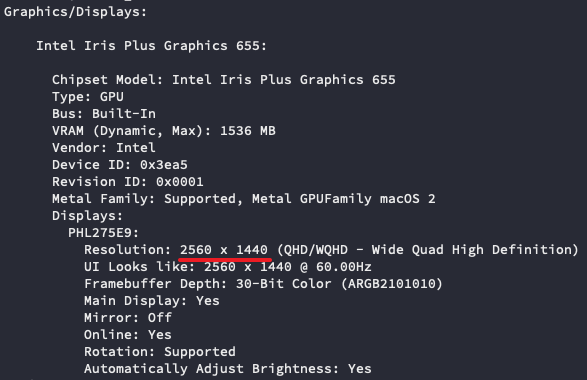

# 获得屏幕宽高尺寸 (像素)

## Tkinter

```py
import tkinter

def get_screen_size() -> tuple[int, int]:
    root = tkinter.Tk()
    width = root.winfo_screenwidth()
    height = root.winfo_screenheight()
    root.destroy()
    return width, height
```

## 调用系统 API (macOS 专用)

优点: 不需要安装第三方库, 也不需要 tkinter.

```py
import re
import subprocess as sp

def get_screen_size() -> tuple[int, int]:
    result = sp.run(
        'echo $(system_profiler SPDisplaysDataType)',
        #   notice the spelling, there is a 's' in 'SPDisplaysDataType'.
        text=True,
        shell=True,
        stdout=sp.PIPE,
    )
    match = re.search(r'Resolution: (\d+) x (\d+)', result.stdout)
    width, height = map(int, match.groups())
    return width, height
```

如果在命令行中输入 `echo $(system_profiler SPDisplaysDataType)`, 得到的输出如下:



我们的代码就是提取了图中红线的部分.
