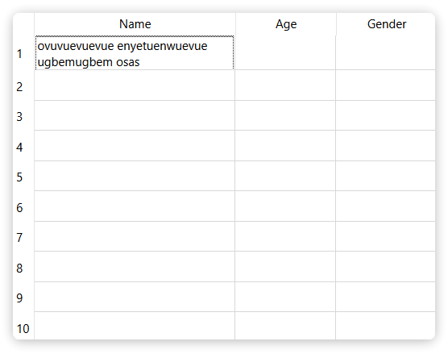

# TableWidget 单元格内容过长自动换行

```py
from PySide6.QtWidgets import *

app = QApplication()
win = QWidget()
win.resize(600, 400)

table = QTableWidget(win)
table.setRowCount(10)
table.setColumnCount(3)
table.setHorizontalHeaderLabels(['A', 'B', 'C'])
table.setColumnWidth(0, 200)  # 1. fixed column width
table.setWordWrap(True)  # 2. set word wrap mode
table.move(20, 20)
table.resize(560, 360)

item = QTableWidgetItem('ovuvuevuevue enyetuenwuevue ugbemugbem osas')
table.setItem(0, 0, item)
table.resizeRowToContents(0)  # 3. resize row to contents

win.show()
app.exec()
```


